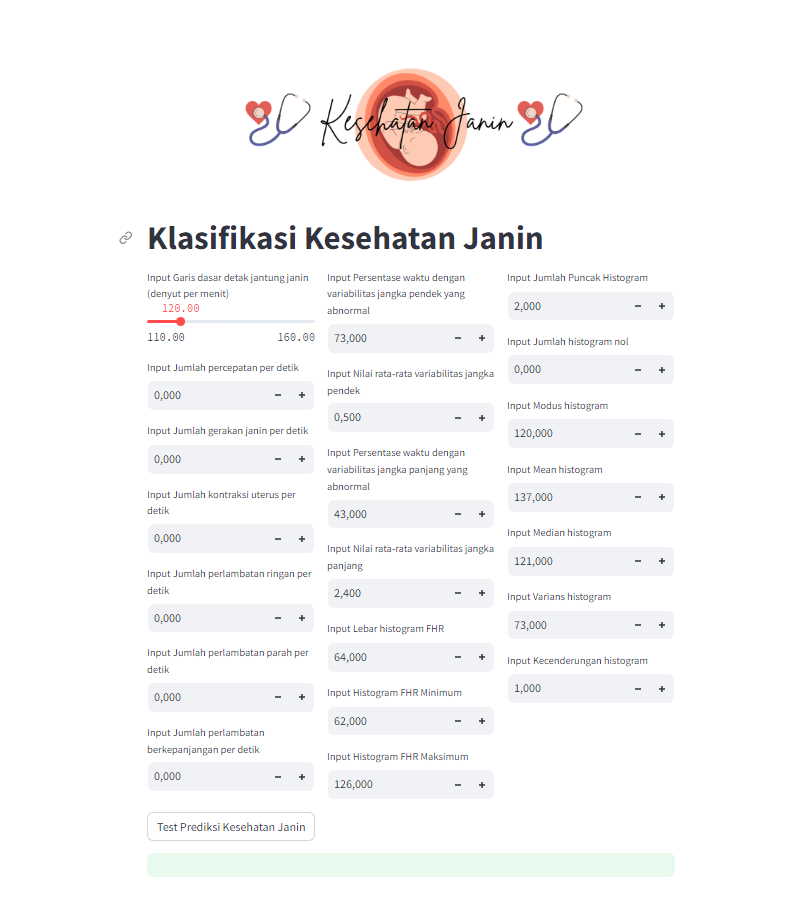

# Laporan Proyek Machine Learning

<table>
<tr>
<td>Nama</td>
<td>:</td>
<td>Nita Andriani</td>
</tr>
<tr>
<td>NIM</td>
<td>:</td>
<td>211351104</td>
</tr>
<tr>
<td>Kelas</td>
<td>:</td>
<td>Informatika Malam B</td>
</tr>
</table>

## Domain Proyek

Proyek Klasifikasi Kesehatan Janin ini bertujuan untuk memberikan peringatan dini terhadap potensi masalah kesehatan janin dengan menggunakan data dari 
pemeriksaan cardiotocography (CTG) dan memberikan bantuan kepada tenaga medis dalam pengambilan keputusan yang lebih tepat terkait perawatan ibu dan janin selama kehamilan. 
Dalam hal ini kesehatan janin di klasifikasikan dalam 3 kategori yaitu:
- Normal : Mengindikasikan bahwa sesuatu berada dalam rentang atau kondisi yang dianggap normal, sehat, atau tidak ada tanda-tanda masalah atau penyakit.
- Suspect : Mengindikasikan bahwa ada kecurigaan atau tanda-tanda tertentu yang menunjukkan bahwa ada potensi masalah atau penyakit,
  tetapi belum cukup bukti untuk mengkonfirmasinya secara pasti.
- Pathologic : Mengindikasikan bahwa ada tanda-tanda penyakit atau kelainan yang jelas dan terukur.

## Business Understanding

Informasi ini bermanfaat bagi tenaga medis yang memiliki spesialisasi dalam obstetri, dengan tujuan mengurangi insiden kematian pada ibu hamil dan janin. 
Hasil penelitian ini juga diharapkan dapat memberikan kontribusi positif dengan memastikan kesehatan pasien seoptimal mungkin.

Bagian laporan ini mencakup:

### Problem Statements

- Bagaimana kita dapat menciptakan solusi yang dapat memberikan peringatan dini terhadap risiko kesehatan janin?
- Bagaimana kita dapat mengoptimalkan penggunaan data CTG untuk meningkatkan prediksi kesehatan janin dengan akurasi yang tinggi?

### Goals

Membuat sistem informasi yang menggunakan model Decision Tree Classifier yang memiliki tingkat akurasi yang tinggi dalam mengidentifikasi masalah kesehatan janin berdasarkan cardiotocography (CTG), sehingga dapat memberikan peringatan dini dan tindakan yang tepat.

### Solution statements

Mengembangkan model machine learning berbasis decision tree yang dapat mengklasifikasikan kesehatan janin menjadi kategori normal, suspect, dan pathologic berdasarkan data CTG yang dikumpulkan. Model ini akan dirancang untuk akurasi dan keandalan tinggi.


## Data Understanding

Dataset yang saya gunakan bersumber dari Kaggle yang berisi Klasifikasi Kesehatan Janin menggunakan CTG untuk meminimalisir kematian ibu dan anak.

Adapun Dataset yang saya gunakan, bisa di akses melalui 
 [Kaggle : Fetal Health Classification](https://www.kaggle.com/datasets/andrewmvd/fetal-health-classification). 

Berikut informasi pada dataset:

- Dataset memiliki format CSV (Comma-Separated Values).
- Dataset memiliki 2126 records data dengan 22 fitur.
- Semua fitur yang ada di dalam dataset bertipe float64.


### Variabel-variabel pada Fetal Health Classification Dataset adalah sebagai berikut:

1. **Baseline Value (Nilai Dasar):** Jumlah detak jantung janin diukur dalam denyut per menit saat berada dalam keadaan stabil atau baseline. [float64] (Min: 110, Max: 160) <br>
2. **Accelerations (Akselerasi):** Jumlah detak jantung janin mengalami peningkatan dalam satu detik. [float64] <br>
3. **Fetal Movement (Gerakan Janin):** Jumlah gerakan atau pergerakan janin dalam satu detik. [float64] <br>
4. **Uterine Contractions (Kontraksi Rahim):** Jumlah kontraksi atau kontraksi rahim dalam satu detik. <br>
5. **Light Decelerations (Pembelahan Ringan):** Jumlah pembelahan atau penurunan detak jantung janin dengan intensitas ringan dalam satu detik. [float64] <br>
6. **Severe Decelerations (Pembelahan Parah):** Jumlah pembelahan atau penurunan detak jantung janin dengan intensitas parah dalam satu detik. [float64] <br>
7. **Prolonged Decelerations (Pembelahan Prolonged):** Jumlah pembelahan atau penurunan detak jantung janin yang berlangsung lama dalam satu detik. [float64] <br>
8. **Abnormal Short-Term Variability (Variabilitas Pendek Abnormal):** Persentase waktu ketika variasi detak jantung janin dalam jangka pendek dianggap tidak normal. [float64] (Min: 0, Max: 100) <br>
9. **Mean Value of Short-Term Variability (Rata-rata Variabilitas Pendek Jangka):** Nilai rata-rata dari variasi detak jantung janin dalam jangka pendek. [float64] <br>
10. **Percentage of Time with Abnormal Long-Term Variability (Persentase Waktu dengan Variabilitas Jangka Panjang Abnormal):** Persentase waktu ketika variasi detak jantung janin dalam jangka panjang dianggap tidak normal. [float64] (Min: 0, Max: 100) <br>
11. **Mean Value of Long-Term Variability (Rata-rata Variabilitas Jangka Panjang):** Nilai rata-rata dari variasi detak jantung janin dalam jangka panjang. [float64] <br>
12. **Histogram Width (Lebar Histogram):** Ukuran lebar distribusi frekuensi detak jantung janin. [float64] <br>
13. **Histogram Min (Minimum Histogram):** Nilai terendah atau frekuensi rendah dalam histogram detak jantung janin. [float64] <br>
14. **Histogram Max (Maksimum Histogram):** Nilai tertinggi atau frekuensi tinggi dalam histogram detak jantung janin. [float64] <br>
15. **Histogram Number of Peaks (Jumlah Puncak Histogram):** Jumlah puncak atau titik tertinggi dalam histogram detak jantung janin. [float64] <br>
16. **Histogram Number of Zeroes (Jumlah Nol Histogram):** Jumlah nol atau titik terendah dalam histogram detak jantung janin. [float64] <br>
17. **Histogram Mode (Modus Histogram):** Nilai yang muncul paling sering dalam histogram detak jantung janin. [float64] <br>
18. **Histogram Mean (Rata-rata Histogram):** Nilai rata-rata dari semua nilai dalam histogram detak jantung janin. [float64] <br>
19. **Histogram Median (Median Histogram):** Nilai tengah dalam urutan nilai dalam histogram detak jantung janin. [float64] <br>
20. **Histogram Variance (Variansi Histogram):** Ukuran sebaran atau variasi antara nilai-nilai dalam histogram detak jantung janin. [float64] <br>
21. **Histogram Tendency (Kemiringan Histogram):** Indikasi arah atau kecenderungan dari distribusi frekuensi dalam histogram detak jantung janin. [float64] <br>
22. **Fetal Health (Kesehatan Janin):**  Mengacu pada kondisi kesehatan janin selama masa kehamilan. Dikategorikan menjadi normal, suspect, Pathologic. [float64] <br>


## Data Preparation

Untuk tahap Data Preparation, saya menggunakan Teknik Exploratory Data Analysis (EDA) dan Visual Data Analysis (VDA).
Proses EDA dan VDA dilakukan dengan menganalisis dataset untuk mendapatkan pemahaman yang utuh terkait dengan dataset guna mendapatkan insight & knowledge.

Tahapan EDA dan VDA yang saya lakukan antara lain:

Mengunggah Token API Kaggle agar dapat mengunduh dataset yang ada di Kaggle.

```
from google.colab import files
files.upload()
```
Membuat Direktori untuk token kaggle.
```
!mkdir -p ~/.kaggle
!cp kaggle.json ~/.kaggle/
!chmod 600 ~/.kaggle/kaggle.json
!ls ~/.kaggle
```
Mengunduh dataset yang ada di Kaggle.
```
!kaggle datasets download -d andrewmvd/fetal-health-classification
```
Membuat direktori untuk dataset lalu mengekstrak dataset yang sudah di unduh sebelumnya.
```
!!mkdir fetal-health-classification
!unzip fetal-health-classification.zip -d fetal-health
!ls fetal-health-classification
```
Mengimport library-library yang akan digunakan dalam proyek.
```
import pandas as pd
import numpy as np
import matplotlib.pyplot as plt
import seaborn as sns
```
Membaca file .csv yang ada dalam dataset dari kaggle menjadi dataframe.
```
df = pd.read_csv('fetal-health/fetal_health.csv')
```
Untuk memastikan dataset sudah terbaca, dilakukan dataset.head() untuk melihat 5 teratas dari dataframe.
```
df.head()
```
Setelah itu, kita perlu memeriksa informasi umum dari dataset yang kita gunakan guna mengetahui tipe data apa saja yang ada dalam dataset kita.

```
df.info()
```

Karena dalam dataset tersebut ada satu nama kolom yang memiliki spasi (baseline value), saya mengubah nama kolom tersebut menjadi (baseline_value). 
```
df = df.rename(columns={'baseline value': 'baseline_value'})
```
Hal ini saya lakukan untuk mempermudah saya saat nantinya akan dimasukan kedalam code python.

Untuk memvisualisasikan pola kekosongan data dalam dataframe saya menggunakan library seaborn.
```
sns.heatmap(df.isnull())
```


Selanjutnya, saya perlu mengetahui informasi mengenai statistik deskriptif dari dataframe. 
```
df.describe()
```


Menampilkan matriks korelasi untuk mengetahui sejauh mana kolom-kolom dalam dataframe berhubungan satu sama lain.
```
plt.figure(figsize=(18,18))
sns.heatmap(df.corr(), annot=True)
```


**Visualisasi Data**

1. Visualisasi Distribusi data menggunakan histogram

2. Visualisasi dengan pie chart untuk mengetahui jumlah distribusi kelas


Gambar tersebut memberikan informasi bahwa terdapat 78% pasien normal, 14% pasien suspect, dan 8% pasien pathological.


## Modeling
Pada Tahap Modeling saya menggunakan model DecisionTreeClassifier dari library sklearn. 
Decision Tree Classifier adalah salah satu algoritma pembelajaran mesin yang digunakan untuk tugas klasifikasi. Ini adalah model prediksi yang mengambil keputusan berdasarkan aturan yang ditemukan dari data pelatihan. Model ini membentuk struktur pohon yang menggambarkan serangkaian keputusan yang harus diambil berdasarkan fitur-fitur data masukan, dan akhirnya memprediksi kelas atau label keluaran.
Tahap awal yang saya lakukan adalah sebagai berikut:

**Mengidentifikasi variabel independen dan dependen.**
```
ind_col = [col for col in df.columns if col != 'fetal_health']
dep_col = 'fetal_health'
```
```
x = df[ind_col] #features
y = df[dep_col] #label
```
ind_col adalah variabel yang berisi daftar kolom-kolom dalam DataFrame , kecuali kolom dengan nama 'fetal_health'. Ini digunakan untuk menyimpan fitur-fitur yang akan digunakan sebagai variabel independen dalam analisis data. <br>
dep_col adalah variabel yang berisi nama kolom 'fetal_health'. Kolom ini adalah kolom target atau kolom yang akan diprediksi dalam analisis data. 

**Pembagian Train & Test**
```
from sklearn.model_selection import train_test_split
x_train, x_test, y_train, y_test = train_test_split(x, y, test_size=0.20, random_state=0)
```
Dengan menggunakan fungsi train_test_split dari library sklearn, dapat membagi data train dan test. Data train sebesar 80% dari total data dan data test sebesar 20% dari total data.

**Penskalaan Data**
```
from sklearn.preprocessing import StandardScaler
scaler = StandardScaler()
x_train = scaler.fit_transform(x_train)
x_test = scaler.transform(x_test)
```
dengan menggunakan fungsi StandardScaler, dilakukan penskalaan data dalam dataframe. Proses ini penting sehingga setiap fitur memiliki skala yang serupa atau setara


**Import Library Sklearn untuk pembuatan Model Decision Tree Classifier dan Melalukan Pengukuran Akurasi**
```
from sklearn.metrics import accuracy_score, confusion_matrix, classification_report
from sklearn.tree import DecisionTreeClassifier
from sklearn import tree

dtc = DecisionTreeClassifier(
    ccp_alpha=0.0, class_weight=None, criterion='entropy',
    max_depth=4, max_features=None, max_leaf_nodes=None,
    min_impurity_decrease=0.0, min_samples_leaf=1,
    min_samples_split=2, min_weight_fraction_leaf=0.0,
    random_state=42, splitter='best'
)

model = dtc.fit(x_train, y_train)

dtc_acc = accuracy_score(y_test, dtc.predict(x_test))

print(f"Akurasi Data Training = {accuracy_score(y_train, dtc.predict(x_train))}")
print(f"Akurasi Data Testing = {dtc_acc} \n")
```


dari output yang ada, akurasi dari training mencapai nilai 92% dan akurasi data testing sebanyak 90%. 

Saya Mencoba pengetesan menggunakan data yang ada dumy untuk memeriksa apakah outputnya bisa muncul atau tidak.
```input_data = (122.0,0.0,0.0,0.003,0.0,0.0,0.0,86.0,0.3,6.0,10.6,68.0,62.0,130.0,1.0,0.0,122.0,122.0,123.0,1.0,1.0)

input_data_as_numpy_array = np.array(input_data)

input_data_reshape = input_data_as_numpy_array.reshape(1, -1)

prediction = model.predict(input_data_reshape)
print(prediction)

if (prediction[0] == 1.0):
  print ('Pasien Normal')
elif prediction[0] == 2.0:
    print('Pasien Suspect')
else:
    print('Pasien Pathological')
```

**Visualisasi Pohon Keputusan**


Sebelum menyelesaikan tahap modeling, tentu saja, saya perlu menyimpan model mesin yang telah dilatih sebagai file dengan ekstensi .sav. Hal ini bertujuan untuk pengembangan dalam aplikasi streamlit nya.
```
filename = "fetal_model.sav"
pickle.dump(model, open(filename, 'wb'))
```


## Evaluation

Dalam tahap evaluasi, saya menggunakan confusion matrix serta classification report.

Confusion matrix (matriks kebingungan) adalah alat evaluasi yang digunakan dalam statistik dan pembelajaran mesin untuk mengukur kinerja model klasifikasi. Matriks ini membandingkan prediksi model dengan nilai aktual atau ground truth pada data uji. Confusion matrix terdiri dari empat sel utama:
- True Positives (TP): Ini adalah jumlah contoh yang benar-benar positif yang diprediksi dengan benar oleh model.
- True Negatives (TN): Ini adalah jumlah contoh yang benar-benar negatif yang diprediksi dengan benar oleh model.
- False Positives (FP): Ini adalah jumlah contoh yang sebenarnya negatif tetapi salah diprediksi sebagai positif oleh model. Ini juga dikenal sebagai kesalahan Type I.
- False Negatives (FN): Ini adalah jumlah contoh yang sebenarnya positif tetapi salah diprediksi sebagai negatif oleh model. Ini juga dikenal sebagai kesalahan Type II.

Sedangkan, Classification report adalah laporan atau ringkasan yang digunakan untuk mengevaluasi kinerja model klasifikasi dalam pembelajaran mesin. Laporan ini berisi berbagai metrik evaluasi yang membantu dalam menilai sejauh mana model klasifikasi berhasil dalam memprediksi kelas atau label target. Biasanya, classification report mencakup beberapa metrik utama, termasuk:
- Akurasi (Accuracy): Akurasi mengukur sejauh mana model mampu memprediksi dengan benar. Ini adalah rasio antara jumlah prediksi benar (True Positives dan True Negatives) dengan total sampel.
- Presisi (Precision): Presisi mengukur sejauh mana prediksi positif model adalah benar. Ini adalah rasio antara True Positives dengan total prediksi positif (True Positives dan False Positives).
- Recall (Sensitivitas): Recall mengukur sejauh mana model mampu menemukan semua instance positif yang sebenarnya. Ini adalah rasio antara True Positives dengan total instance positif (True Positives dan False Negatives).
- F1-Score: F1-Score adalah ukuran gabungan dari presisi dan recall. Ini memberikan bobot yang seimbang antara kedua metrik tersebut dan berguna ketika ada trade-off antara presisi dan recall.
- Support: Support adalah jumlah instance dalam setiap kelas, yang memberikan konteks tentang seberapa besar kelas tersebut dalam data uji.

```
print(f"confusion matrix : \n{confusion_matrix(y_test, dtc.predict(x_test))}\n")
confusion = confusion_matrix(y_test, dtc.predict(x_test))
tn, fp, fn = confusion[0, 0], confusion[0, 1], confusion[0, 2]
tp, fn, fp = confusion[1, 1], confusion[1, 0], confusion[1, 2]
tn, fp, fn = confusion[2, 0], confusion[2, 1], confusion[2, 2]

class_labels = ['1 - Normal', '2 - Suspect', '3 - Pathological']
plt.figure(figsize=(8, 6))
sns.heatmap(confusion, annot=True, fmt='d', cmap='Blues', cbar=False,
            xticklabels=['Normal', 'Suspect', 'Pathological'], yticklabels=['Normal', 'Suspect', 'Pathological'])
plt.xlabel('Prediksi')
plt.ylabel('Aktual')
plt.title('Confusion Matrix')
plt.show()
print(f"classification Report: \n {classification_report(y_test, dtc.predict(x_test))}")
```
Kode tersebut menunjukan hasil sebagai berikut: 


Dari Hasil Classification Report yang disajikan, kita mendapatkan sejumlah metrik evaluasi yang berguna menilai kinerja model klasifikasi pada tiga kelas atau pada label yang berbeda (1.0, 2.0, 3.0). Berikut penjelasan lebih lanjut mengenai classification report: 

1. Precision: Ini adalah tingkat keakuratan prediksi positif. Precision mengukur seberapa banyak dari prediksi positif yang benar. Dalam kasus ini:
   
   - Untuk kelas 1.0, presisi adalah 0.92, yang berarti sekitar 92% dari prediksi kelas 1.0 benar.
   - Untuk kelas 2.0, presisi adalah 0.73, yang berarti sekitar 73% dari prediksi kelas 2.0 benar.
   - Untuk kelas 3.0, presisi adalah 0.95, yang berarti sekitar 95% dari prediksi kelas 3.0 benar.

2. Recall (Sensitivitas): Recall mengukur seberapa banyak dari instance positif yang berhasil ditemukan oleh model. Dalam kasus ini:
   
   - Untuk kelas 1.0, recall adalah 0.96, yang berarti model dapat menemukan sekitar 96% dari instance yang sebenarnya kelas 1.0.
   - Untuk kelas 2.0, recall adalah 0.62, yang berarti model dapat menemukan sekitar 62% dari instance yang sebenarnya kelas 2.0.
   - Untuk kelas 3.0, recall adalah 0.83, yang berarti model dapat menemukan sekitar 83% dari instance yang sebenarnya kelas 3.0.

3. F1-Score: F1-score adalah pengukuran gabungan dari presisi dan recall. Ini memberikan bobot yang seimbang antara kedua metrik tersebut dan berguna ketika ada trade-off antara presisi dan recall. Dalam kasus ini, F1-score dihitung untuk setiap kelas.

4. Support: Support adalah jumlah instance dalam setiap kelas, memberikan konteks tentang seberapa besar kelas tersebut dalam data uji. Misalnya, kelas 1.0 memiliki dukungan sejumlah 326 instance dan seterusnya.

5. Accuracy: Akurasi adalah sejauh mana model secara keseluruhan memprediksi dengan benar untuk semua kelas. Dalam kasus ini, akurasi adalah sekitar 90%, yang berarti sekitar 90% dari semua prediksi benar.


## Deployment



[Aplikasi Klasifikasi Kesehatan Janin](https://fetal-health-app-nita27.streamlit.app/)


